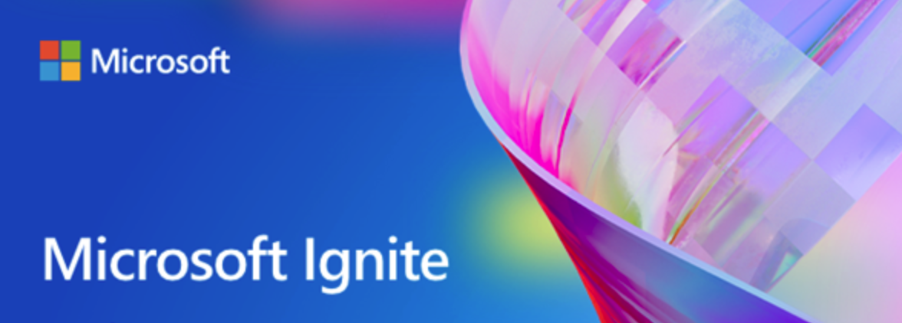
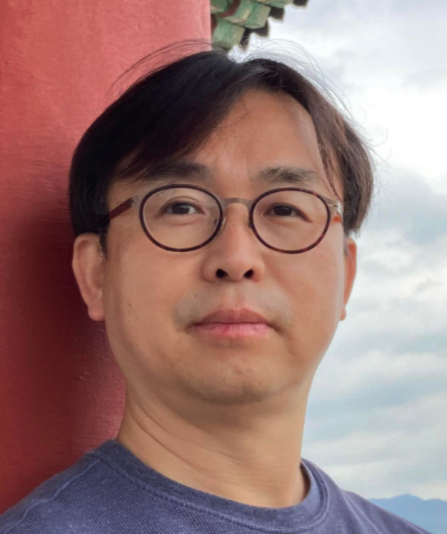
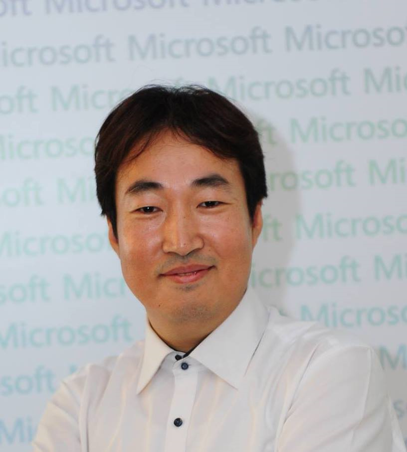
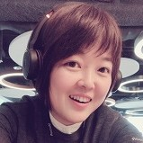
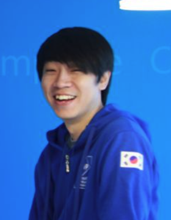

 

# Ignite 2022 리브리핑 토크 이벤트

Microsoft Ignite는 매년 개최되는 Microsoft의 향후를 미리 볼 수 있는 대형 기술 컨퍼런스 입니다. 올해도 변함없이 한국 시간으로 13일~15일 사이에 새벽에 개최 됩니다. 키노트 세션 이외에도 많은 세션들이 동시에 열리게 되었습니다. 

 전체 세션이 영어로 진행되고 그리고 새벽에 행사가 진행되기 때문에 전체 행사를 토크쇼 형태로 편하게 볼 수 있는 온라인 행사를 준비했습니다. 

- 장소: [유튜브 https://www.youtube.com/watch?v=fdxGBdsZnW8](https://www.youtube.com/watch?v=fdxGBdsZnW8)
   [[일정.ics]](../events/images/20221015/Ignite%202022%20%EB%A6%AC%EB%B8%8C%EB%A6%AC%ED%95%91%20%ED%86%A0%ED%81%AC%20%EC%9D%B4%EB%B2%A4%ED%8A%B8.ics)
- 시간: 2022년 10월 15일 저녁 08:00
- 대상: 누구나
- 무료 이벤트

## Contents

- Ignite 2022 이모저모
- Microsoft Azure, Microsoft 365 및 새로 발표되는 다양한 내용들
- 재미있는 세션들 소개... 

## Speakers
|이름|소개|
|--------------------------------------------------------------------------------------------------------------|-----------------------------------------------------------------------------------------------------------------------------------------------------------------|
|  | <b>김도균 Microsoft MVP (Azure)</b>  이젠 고인물이 된 Microsoft MVP이자 Microsoft MCT.  '처음 배우는 애저'를 비롯해 몇 권을 책을 집필하고 번역했다.|
||<b>김영욱 Microsoft MVP (Azure)</b>  Dobby is free를 외치며 자유를 찾아나와 AI와 Azure로 주로 일하고 있다. 최근에는 다수의 과정과 특강을 하고 있다.   지금은 Hello AI를 만들어서 다양한 일과 활동을 하고 있다.|
||<b>박은정 Microsoft MVP (M365 and app)</b>  [내용 준비중]|
||<b>주신영 Korea Azure User Group</b>  [내용 준비중]|

